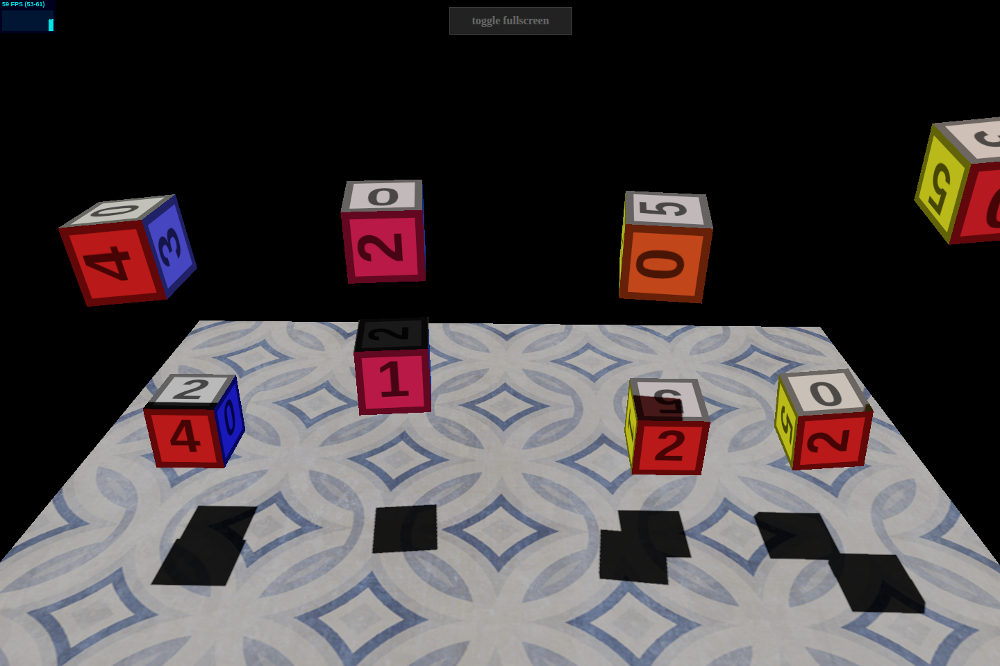

# webgl-test

Small browser-based WebGL demos from older experiments, lightly updated to run
cleanly in a current browser/tooling setup.

Live listing: https://lukleh.github.io/webgl-test/

## Screenshot



## Demos

- `cubes.html`: floating textured cubes in a simple scene
- `camera.html`: camera access test
- `scout.html`: a small city / maze-style scene
- `face_shapes.html`: live camera texture mapped onto 3D shapes

## Local development

The repo is still a set of static HTML pages. Vite is only used as a modern
dev server and static build wrapper.

```bash
npm install
npm run dev
```

To create a production build and preview it locally:

```bash
npm run build
npm run preview
```

## Notes

- The demos use pinned CDN imports for Three.js, `stats.js`, and `screenfull`.
- `camera.html` and `face_shapes.html` require camera permission and should be
  served over HTTP(S), not opened directly from disk.
- The codebase keeps the original “small demo” structure rather than converting
  everything into a bundled app.
- Three.js color-space settings were updated to the current API where the older
  `outputEncoding` and `encoding` properties no longer exist.

## Status

This is an old demo repo, not a polished library or product. The goal of the
current update is simple: make it easy to run again in 2026 without rewriting
the demos into something larger than they need to be.
